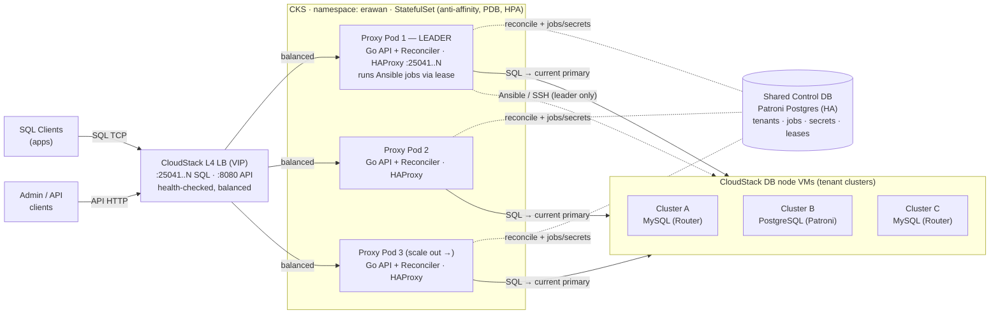
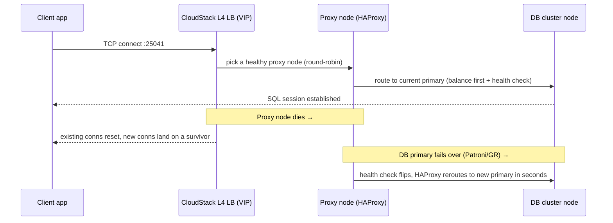

# HA Proxy-Node Architecture (CloudStack)

This document designs the **erawan-cluster proxy node** as a horizontally scalable,
zero-downtime tier on **Apache CloudStack**, while keeping the **Go API embedded**
in every node (not split out into a separate service).

Goals:

- **Zero downtime** — no single node loss or upgrade drops client SQL traffic or the management API.
- **Scale out** — add nodes to absorb more client connections; nodes self-configure.
- **Long-running** — deploy/add-member jobs survive node restarts and never run twice.
- **Balanced traffic** — client SQL connections *and* management API calls spread across nodes.

The core idea: **every proxy node is identical and stateless. The source of truth is a
shared HA control DB. Each node continuously reconciles its local HAProxy from that DB.**

**Diagram (draw.io):** [diagrams/k8s-ha-architecture.drawio](diagrams/k8s-ha-architecture.drawio)
(GitHub shows `.drawio` as XML; the Mermaid version below renders inline on GitHub.)



---

## 1. Topology on CloudStack

```
                          ┌─────────────────────────────┐
                          │   CloudStack Public IP(s)   │
                          │   (acquired Elastic IP)     │
                          └──────────────┬──────────────┘
                                         │
                        ┌────────────────┴─────────────────┐
                        │   L4 Load Balancer (VIP)          │
                        │   CloudStack LB rules  OR          │
                        │   keepalived/VRRP floating IP      │
                        │   - listener 25041..N → SQL        │
                        │   - listener 8080     → Go API     │
                        └───────┬───────────────┬───────────┘
                                │  (TCP, balanced)│
              ┌─────────────────┼─────────────────┼─────────────────┐
              ▼                 ▼                 ▼                 ▼
   ┌────────────────┐ ┌────────────────┐ ┌────────────────┐   (scale →)
   │  PROXY NODE 1  │ │  PROXY NODE 2  │ │  PROXY NODE 3  │   anti-affinity
   │ ┌────────────┐ │ │ ┌────────────┐ │ │ ┌────────────┐ │   group, 1 per
   │ │ Go API     │ │ │ │ Go API     │ │ │ │ Go API     │ │   CloudStack host
   │ │ :8080      │ │ │ │ :8080      │ │ │ │ :8080      │ │
   │ │ + reconciler│ │ │ │ + reconciler│ │ │ │ + reconciler│ │
   │ └─────┬──────┘ │ │ └─────┬──────┘ │ │ └─────┬──────┘ │
   │ reload│        │ │ reload│        │ │ reload│        │
   │ ┌─────▼──────┐ │ │ ┌─────▼──────┐ │ │ ┌─────▼──────┐ │
   │ │ HAProxy    │ │ │ │ HAProxy    │ │ │ │ HAProxy    │ │
   │ │ :25041..N  │ │ │ │ :25041..N  │ │ │ │ :25041..N  │ │
   │ └─────┬──────┘ │ │ └─────┬──────┘ │ │ └─────┬──────┘ │
   └───────┼────────┘ └───────┼────────┘ └───────┼────────┘
           └──────────────────┼──────────────────┘
                              ▼  (all nodes hold identical tenant config)
              ┌─────────────────────────────────────────┐
              │           SHARED CONTROL DB              │
              │     (Patroni Postgres, 3 nodes, HA)      │  ← source of truth:
              │   tenants · jobs · job_secrets · leases  │    desired HAProxy config,
              └─────────────────────────────────────────┘    job queue, secrets
                              ▲
                              │ ansible over SSH (leader node only)
              ┌───────────────┴───────────────────────────┐
              ▼               ▼               ▼
        ┌──────────┐    ┌──────────┐    ┌──────────┐
        │ DB CLUSTER│   │ DB CLUSTER│   │ DB CLUSTER│   tenant DB VMs
        │ A (MySQL) │   │ B (PgSQL) │   │ C (MySQL) │   (CloudStack instances)
        └──────────┘    └──────────┘    └──────────┘
```

What changes vs. today:

| Concern | Today (single node) | This design |
|---|---|---|
| HAProxy tenant config | local files written by the node that got the request | **desired state in DB**; every node reconciles → identical config everywhere |
| Job state + secrets | local JSON / `.secret` files | **rows in DB** (secrets still AES-encrypted at rest) |
| Who runs ansible | whichever node got the request | **one leased leader at a time** (DB lease) |
| Reach a node | one node | **L4 LB / VIP** spreads SQL + API traffic over all nodes |
| Node loss | outage | LB drops it; survivors keep serving; leader re-elected |

---

## 2. Inside one proxy node

The binary stays embedded — same process exposes the API **and** owns local HAProxy:

```
┌───────────────────────── erawan-cluster (one binary) ─────────────────────────┐
│                                                                                │
│  HTTP API :8080         Reconciler loop            Job runner (leader only)    │
│  ─────────────          ───────────────            ───────────────────────     │
│  • POST /haproxy/...  → writes DESIRED tenant   • polls DB for queued jobs     │
│    writes DB row        config to DB              • acquires per-job lease      │
│  • POST /cluster/...  → enqueues job in DB      • runs ansible-playbook        │
│    returns 202          (does NOT run it here)    • writes job status to DB     │
│  • GET  /jobs/{id}    → reads DB (any node)     • renews lease (heartbeat)     │
│                                                                                │
│         every ~2s / on NOTIFY:                                                 │
│         desired tenant config (DB)  ──►  render *.cfg  ──►  haproxy -c         │
│                                          ──►  graceful reload (SIGUSR2)        │
└────────────────────────────────────────────────────────────────────────────────┘
                                   │
                                   ▼  local HAProxy :25041..N  →  DB node VMs
```

Two background loops are the whole HA story:

1. **Reconciler** (runs on *every* node): make local HAProxy match the DB's desired
   tenant config. This is what makes a brand-new node self-configure and keeps all
   nodes byte-identical.
2. **Job runner** (active on *one* node via lease): execute long-running ansible work
   exactly once, with status visible to all nodes through the DB.

---

## 3. Control DB schema (sketch)

```sql
-- desired HAProxy tenant config (replaces TENANTS_DIR/*.cfg as source of truth)
tenants(
  port int PRIMARY KEY,        -- 25041, 25042, ...
  engine text,                 -- 'mysql' | 'pgsql'
  node_ips jsonb,
  db_port int, patroni_port int,
  rendered_cfg text,           -- the exact HAProxy block to write
  generation bigint,           -- bumped on every change → drives reconcile
  updated_at timestamptz
)

jobs(
  id text PRIMARY KEY,
  type text,                   -- deploy | add_member | remove_member | rollback
  status text,                 -- pending | running | failed | completed
  spec jsonb, steps jsonb, progress int,
  created_at, updated_at timestamptz
)

job_secrets(job_id text PK, ciphertext bytea)   -- AES-256-GCM, same as today

leases(
  name text PRIMARY KEY,       -- 'job:<id>' or 'runner-leader'
  holder text,                 -- node id
  expires_at timestamptz       -- heartbeat-renewed; expiry → failover
)
```

Use Postgres `LISTEN/NOTIFY` (or a 2s poll on `max(generation)`) so config changes
propagate to every node's reconciler within seconds.

> Dogfood note: the control DB can itself be a **Patroni Postgres cluster deployed by
> this very tool**, fronted by the same HAProxy pattern. Start with a small 3-node
> cluster in its own CloudStack network.

---

## 4. Flow — client SQL traffic (zero downtime)

Client connects to the DB *through* the tier. Two independent failure domains
(proxy node, DB node) both fail over without dropping the service.



Zero-downtime properties:
- **Proxy node loss:** LB health check ejects it; new connections go to survivors.
  Run **N+1** nodes so capacity is preserved.
- **DB primary loss:** unchanged from today — HAProxy's `balance first` + health
  check (`tcp-check` for MySQL Router, `GET /leader` for Patroni) reroutes.
- **Config reload:** HAProxy `SIGUSR2` graceful reload never drops active connections.

---

## 5. Flow — tenant config change (converge all nodes)

This replaces "write a file on the one node that got the request." The API only
writes **desired state**; every node converges itself.

```mermaid
sequenceDiagram
    participant C as Client/Admin
    participant LB as LB :8080
    participant API as Go API (any node)
    participant DB as Control DB
    participant R as Reconciler (ALL nodes)
    participant HA as Local HAProxy (each node)

    C->>LB: POST /haproxy/config/mysql {port, node_ips, db_port}
    LB->>API: route to any node
    API->>API: validate (haproxy -c on candidate)
    API->>DB: UPSERT tenants(port,...), generation++
    API-->>C: 200 OK (desired state recorded)

    Note over DB,R: NOTIFY / 2s poll detects new generation
    par every node independently
        R->>DB: read desired tenant configs
        R->>HA: render *.cfg, haproxy -c, graceful reload
    end
    Note over R,HA: all nodes now byte-identical; no node is special
```

Key change: `applyConfig` no longer writes the live file from the request path.
The request **records intent in the DB**; the reconciler is the only writer of
local `*.cfg`. This is what makes config consistent across a scalable tier.

---

## 6. Flow — long-running deploy job (exactly once)

The API never runs ansible inline. It enqueues; the **leased leader** executes.

```mermaid
sequenceDiagram
    participant C as Client
    participant API as Go API (node X)
    participant DB as Control DB
    participant L as Job runner (leader node)
    participant DBN as DB node VMs

    C->>API: POST /cluster/mysql/deploy
    API->>DB: INSERT jobs(status=pending) + job_secrets(enc)
    API-->>C: 202 {job_id}

    loop runner loop on leader
        L->>DB: SELECT pending job; acquire lease 'job:<id>'
        L->>DBN: ansible-playbook (step 1..N)
        L->>DB: update steps/progress after each step (heartbeat lease)
    end

    C->>API: GET /cluster/mysql/jobs/{id}   (LB → any node)
    API->>DB: read job row
    API-->>C: {status, progress}            (any node can answer)
```

Exactly-once + crash safety:
- **Lease per job** — only the lease holder runs it; others skip.
- **Heartbeat** — leader renews `expires_at` while running. If the leader dies
  mid-job, the lease expires, another node picks the job up and **resumes from
  `last_completed_step + 1`** (your existing resume logic, now keyed off DB).
- This generalizes today's `MarkStaleRunningJobsFailed`: instead of failing stale
  jobs, they become **re-leasable**.

---

## 7. Flow — scale out (add a proxy node)

```mermaid
sequenceDiagram
    participant Op as Operator / CloudStack AutoScale
    participant CS as CloudStack
    participant N as New proxy node
    participant DB as Control DB
    participant LB as LB pool

    Op->>CS: deploy VM from proxy template (anti-affinity group)
    CS->>N: boot; erawan-cluster starts (embedded API+HAProxy)
    N->>DB: reconciler reads ALL desired tenant configs
    N->>N: render every *.cfg, haproxy -c, start HAProxy
    N->>LB: health check :25041../:8080 turns green
    LB-->>N: begins sending balanced client + API traffic
    Note over N: node is fully interchangeable — no manual config
```

Because a new node rebuilds its entire HAProxy config from the DB, **scaling is just
"boot another VM from the template."** Use a CloudStack **AutoScale** policy (scale on
connection count / CPU) plus an **anti-affinity group** so replicas land on different
hypervisors (a single host failure never takes the tier down).

---

## 8. Flow — zero-downtime rolling upgrade

```
for each proxy node, one at a time:
  1. LB: drain node  (stop new conns; let SQL sessions finish or cap drain window)
  2. deploy new binary / template version
  3. node boots → reconciler rebuilds HAProxy from DB → self-heals to desired state
  4. LB health check green → re-add to pool
  5. proceed to next node
```

- The job-runner leader is upgraded like any node; if it's mid-job, draining lets
  the lease expire and another node resumes — no job is lost.
- Never upgrade all nodes at once; keep **N+1** so capacity holds during the roll.

---

## 9. CloudStack-specific building blocks

| Need | CloudStack feature |
|---|---|
| Client-facing VIP for SQL + API | Acquire **Public IP** + **LB rules** (per port), or keepalived/VRRP floating IP inside the guest network |
| Spread nodes across hosts | **Anti-affinity group** for the proxy VMs |
| Auto-recover a dead VM | **VM HA** (CloudStack restarts the instance on another host) |
| Grow/shrink the tier | **AutoScale** policy on the LB (NetScaler or native), scaling the proxy VM group |
| Identical nodes | Build a **VM template** with erawan-cluster + HAProxy baked in; nodes differ only by a node-id |
| Network isolation | Separate guest network/VPC tiers: client → proxy, proxy → DB, proxy → control DB |

---

## 10. Decision summary

- **Keep the Go API embedded.** ✅ Every node runs API + reconciler + (maybe) job
  leader. No service split required.
- **Move all state to a shared HA control DB.** Jobs, secrets, and — critically —
  **tenant config as desired state**. This is the single change that unlocks
  scale-out and zero downtime. (Answers the earlier "jobs in a DB?" question: yes,
  *and* tenant config, because that's the part the data plane shares.)
- **Reconcile, don't write-through.** The request path records intent; a per-node
  reconciler renders + reloads HAProxy. Nodes become interchangeable.
- **Lease the job runner.** Long-running ansible work runs exactly once and resumes
  after a crash.
- **Front with a CloudStack L4 LB + anti-affinity + AutoScale.** That delivers
  balanced traffic, host-failure tolerance, and elastic scale.

### Build order (incremental, each step shippable)

1. Add the **control DB** + move **jobs/secrets** off local disk (interface stays
   `Save/Load/List`; swap file store for a DB store).
2. Move **tenant config to DB** + add the **reconciler loop** (still single node —
   behavior identical, but now DB-driven).
3. Add **job leasing / leader election** so >1 node is safe.
4. Stand up **2+ nodes behind the CloudStack LB**; bake the **template**; enable
   **anti-affinity + AutoScale**.
```
